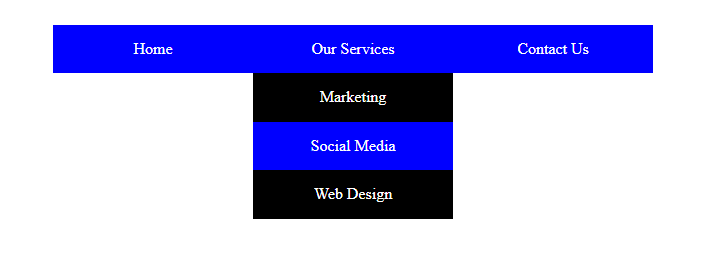
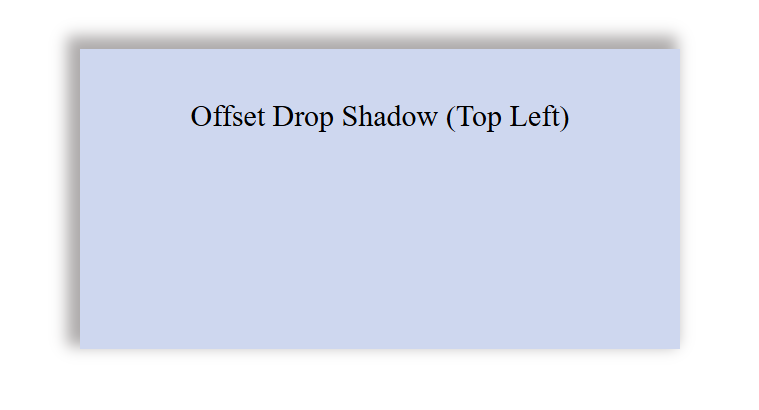
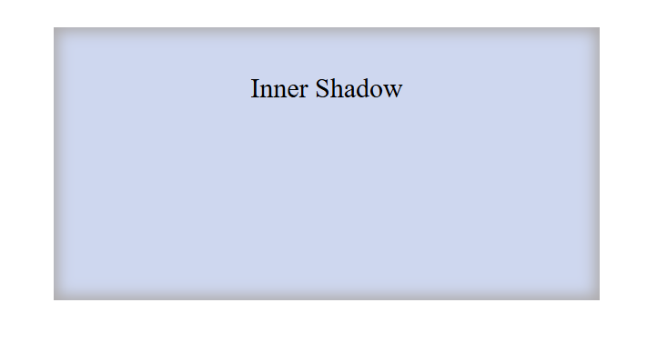

# 🖼️ Práctica CSS: Sombras y Menús

Proyecto enfocado en el aprendizaje y práctica de **propiedades visuales en CSS**, con énfasis en **sombras (box-shadow, text-shadow)** y **menús desplegables**, como parte del reto **#100DaysOfCode**.

> _"Una de las mejores formas de aprender CSS es jugar con sus propiedades. Este proyecto muestra cómo pequeños cambios en estilos pueden tener un gran impacto visual."_  
> — [Publicación en LinkedIn](https://www.linkedin.com/posts/frank-jimenez-barragan-584782352_100daysofcode-frontenddev-aprendiendoprogramaciaejn-activity-7315598255583617024-6lVL)

---

## 📚 Tabla de Contenidos

- [🎯 Objetivo](#-objetivo)
- [🛠️ Tecnologías Utilizadas](#️-tecnologías-utilizadas)
- [📸 Capturas de Pantalla](#-capturas-de-pantalla)
- [🚀 Cómo Ejecutarlo](#-cómo-ejecutarlo)
- [✨ Funcionalidades](#-funcionalidades)
- [🧩 Estructura del Proyecto](#-estructura-del-proyecto)
- [📌 Autor](#-autor)
- [📄 Licencia](#-licencia)

---

## 🎯 Objetivo

Explorar y practicar con diferentes propiedades de **CSS** para:
- Aplicar sombras a texto y contenedores.
- Crear efectos visuales con `box-shadow` e `inner-shadow`.
- Desarrollar menús de navegación con submenús desplegables.
- Mejorar la estética visual utilizando solo HTML y CSS.

---

## 🛠️ Tecnologías Utilizadas

- HTML5
- CSS3

No se utiliza ningún framework ni librería externa.

---

## 📸 Capturas de Pantalla

### 📁 Menú desplegable



### ✨ Sombra en texto

  


### 📦 Sombras en contenedores

- **Sombra desplazada superior izquierda**  


- **Sombra interior**  


---

## 🚀 Cómo Ejecutarlo

1. Clona el repositorio:
   ```bash
   git clone https://github.com/FrankJimenez79/practica_css_sombras.git
   ```
2. Abre el archivo `index.html` en tu navegador web.

No se requiere instalación ni dependencias adicionales.

---

## ✨ Funcionalidades

- Menú de navegación con submenús visibles al hacer hover.
- Aplicación de sombras creativas usando solo CSS.
- Textos con profundidad y efectos 3D.
- Estilos claros para practicar distintos enfoques visuales.

---

## 🧩 Estructura del Proyecto

```
practica_css_sombras/
│
├── index.html
├── estilos.css
└── (capturas de pantalla)
```

---

## 📌 Autor

**Frank Jiménez Barragán**  
Frontend Developer en formación — apasionado por el diseño y la creatividad en la web.  
🔗 [LinkedIn](https://www.linkedin.com/in/frank-jimenez-barragan-584782352/)

---

## 📄 Licencia

Este proyecto está bajo la licencia MIT.  
Puedes utilizarlo, modificarlo y compartirlo libremente.
